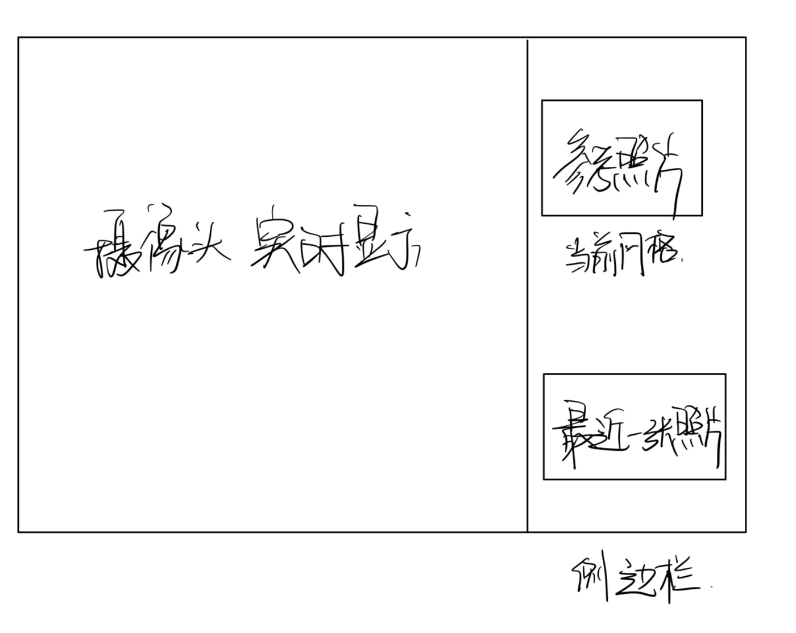
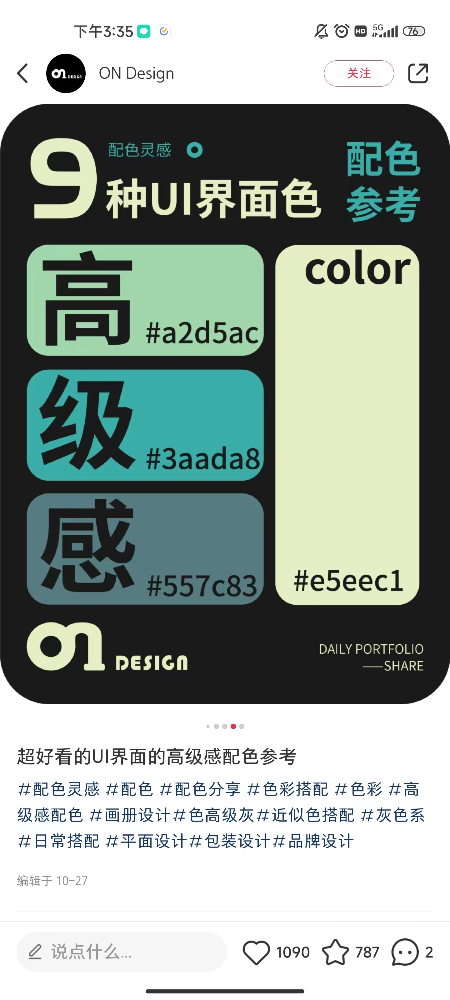

# 说明文档

[TOC]

## 1.代码明细
Requirements：

opencv-python
mediapipe
scikit-learn
pycaw
numpy
comtypes

使用说明：需要用户先建立自定义微数据集，说明见后，根据用户自定义的三个手势(比如说，可以第0类为peace/yeah，第1类为手掌张开，第2类为拳头紧握)

HandTrackingModule.py：无需运行，只需和其他程序文件放在相同目录下即可。

Collect&Train.py：在使用项目之前，运行此程序，建立用户的自定义微数据集。在弹出画面框后(要提前摆好手势哦)，根据屏幕上的提示(press "r" to begin)，分别录入用户自定义的三个不同手势。
	推荐用户在录入一类微数据集的过程中慢慢在各个方向旋转手部来实现数据增强。
	此程序会在用户按下“r”后连续地收集摄像头画面来创建自定义微数据集(三类手势，每一类收集100张图片)，并根据微数据集训练出分类模型，导出为model.p文件。
	可以在程序创建的imgs文件夹中看到收集到的数据集，还可以检查生成的DATASET.csv中是否收齐300条数据。

RunSystem.py：在运行过Collect&Train.py后(确保已经生成model.p文件)，运行此程序。该程序中定义了四类手势，将前三类置信度不高的识别为第四类以达到前三类的识别准确度。现在的功能为识别到前三类且识别到人脸就拍照，拍照间隔为0.5s。（需要更改）

facedetect.py ：只含有人脸监测的调包程序（没有用）

*注意：
1、推荐为此系统单独创建一个文件夹，因为运行过程中会在当前目录下生成其他文件和文件夹。
	
2、创建自定义数据集时，(1)保证按下“r”直到屏幕上再次显示提示的过程中都能收集到有效的画面，即手部一直保持于画面框内且维持同样地手势。(2)推荐用户在录入一类微数据集的过程中在各个方向旋转手部来实现数据增强。(但也要保证手部一直在画面框内)

3、此系统目前只支持单手操作。

##  2.需求

### 2.1 界面大致样子

参考界面

最近一张照片指在最近一张拍摄的照片

参考配色

### 2.2 功能
 设置有五种风格的参考照片，分别为潮流、优雅、搞怪、甜美、古风，参考照片每种风格有25张，在对应文件夹中。用户界面显示一张参考照片及对应风格。

 由上的三种手势，手势一对应开始拍摄照片，设置拍摄时间为10s，在这10s内只要识别到人脸就拍照。手势二对应切换参考照片，从该风格的库中再选取一张照片。手势三对应切换风格。